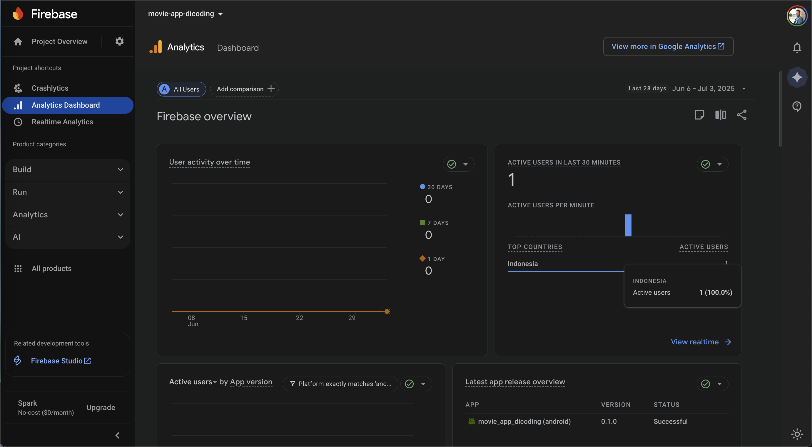
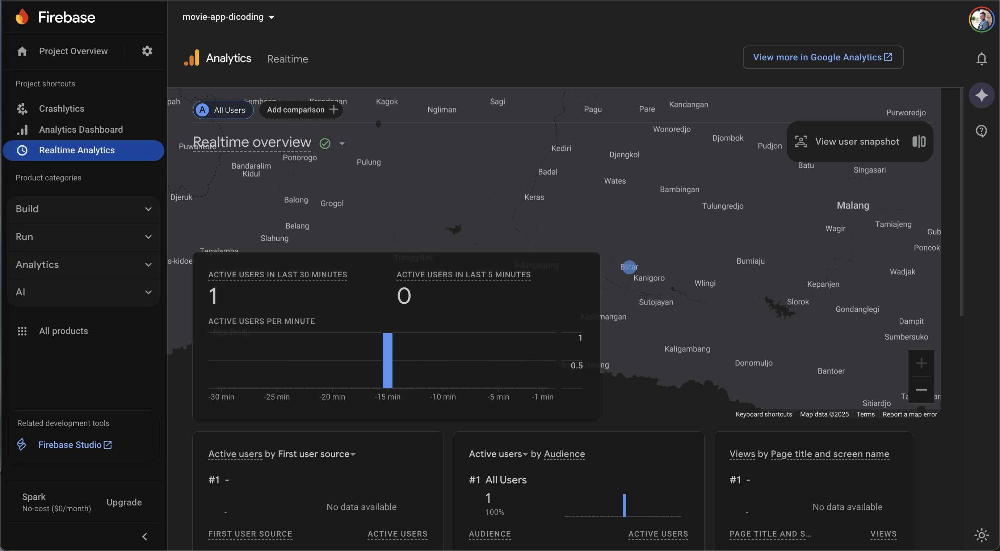
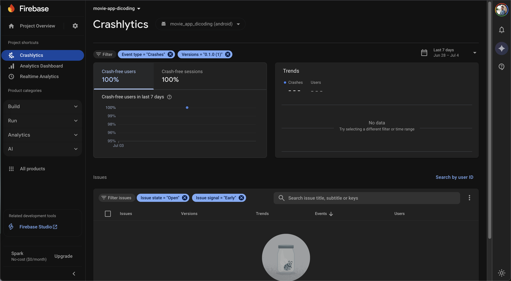
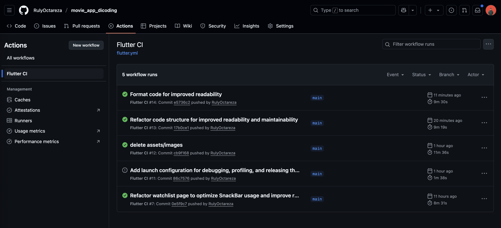
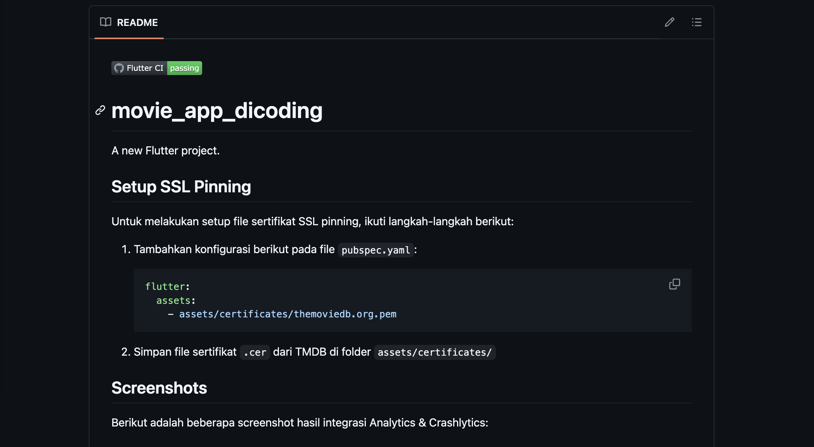

[](https://github.com/RulyOctareza/movie_app_dicoding/actions)

# movie_app_dicoding

A new Flutter project.

## Setup SSL Pinning

Untuk melakukan setup file sertifikat SSL pinning, ikuti langkah-langkah berikut:

1. Tambahkan konfigurasi berikut pada file `pubspec.yaml`:

   ```yaml
   flutter:
     assets:
       - assets/certificates/themoviedb.org.pem
   ```

2. Simpan file sertifikat `.cer` dari TMDB di folder `assets/certificates/`

## Screenshots

Berikut adalah beberapa screenshot hasil integrasi Analytics & Crashlytics:

### Firebase Analytics




### Firebase Crashlytics



## Build Status



